# Reinforcement Learning for Alpha Factor Mining: A Review of Problem Formulation, Methods, and Challenges

## Abstract

Formulaic alpha mining has become a key problem at the intersection of quantitative finance, reinforcement learning, and symbolic search. The core task is to discover interpretable predictive formulas from a large, grammar-constrained combinatorial space, while evaluation is typically delayed, noisy, and computationally expensive because it relies on offline backtesting or factor-analysis pipelines. These properties make alpha mining substantially different from standard RL benchmarks and motivate careful problem-specific methodology design.

This review synthesizes the recent RL-based literature by organizing it around four layers: problem formulation, methodological paradigms, comparative analysis of representative papers, and open challenges with future directions. Rather than following a purely chronological narrative, we emphasize structural differences across approaches, including policy-based generation, search-enhanced exploration, reward shaping and variance reduction, distributional/risk-aware learning, and dynamic factor combination.

The central conclusion is that RL is a promising but not fully sufficient solution for alpha mining. Current bottlenecks are driven less by agent architecture alone and more by evaluator realism, reward design, search structure, and market non-stationarity. Progress is therefore likely to come from tighter integration between RL, symbolic search, and robust evaluation protocols, with stronger attention to multi-objective deployment constraints.

## Notation

An alpha-construction episode is modeled as a finite-horizon decision process. We use \(s_t\) for state, \(a_t\) for action, \(f\) for a candidate formula, and \(\mathcal{P}\) for a factor pool. The policy is denoted by \(\pi_\theta(a_t\mid s_t)\). Rewards are \(R_t\), with return \(G_t=\sum_{k=t}^{T}\gamma^{k-t}R_k\). In many settings, reward is terminal: \(R_t=0\) for \(t<T\), and \(R_T=\mathrm{Eval}(f)\).

For financial evaluation, let \(r_{i,t+1}\) denote the future return of asset \(i\), and let \(f_{i,t}\) denote the factor value assigned to asset \(i\) at time \(t\). Cross-sectional information coefficient is written as

\[
\mathrm{IC}_t(f)=\mathrm{corr}\!\left(f_{:,t},\, r_{:,t+1}\right),
\]

and its sample average over an evaluation window of length \(N\) is

\[
\overline{\mathrm{IC}}(f)=\frac{1}{N}\sum_{t=1}^{N}\mathrm{IC}_t(f).
\]

When needed, we use standard value-function notation \(Q^\pi, V^\pi, A^\pi\). In dynamic combination settings, \(w_t\) denotes factor weights at time \(t\).

## 1. Introduction

Alpha factor mining is a central problem in quantitative finance. Its goal is to discover signals that can predict future returns, relative performance, or other investment-relevant outcomes from large collections of market features. In practice, however, factor discovery has long relied on manual design, heuristic search, and repeated trial and error by human researchers. As feature libraries, operator sets, and candidate formula spaces continue to expand, this workflow becomes increasingly difficult to scale.

This difficulty is not merely a matter of prediction. Formulaic alpha mining is fundamentally a structured search problem over a vast combinatorial space of symbolic expressions. Candidate factors are assembled from raw features and operators under syntax constraints, then evaluated by offline metrics such as information coefficient, portfolio return, or risk-adjusted performance. The search space is discrete, hierarchical, and heavily constrained; the evaluation is delayed, noisy, and often expensive. These properties make the task qualitatively different from standard supervised learning settings in which a fixed hypothesis class is optimized with dense labels.

Reinforcement learning (RL) has therefore emerged as a natural tool for this setting. A factor can be constructed step by step, with each decision selecting a feature, operator, subtree expansion, or termination action. The agent receives useful feedback only after a complete expression or factor set has been generated and evaluated. From this perspective, alpha mining can be modeled as episodic sequential decision making over structured symbolic objects. This formulation has motivated a growing line of work on policy-based expression generation, search-enhanced exploration, reward shaping, distributional RL, and dynamic factor combination.

At the same time, the use of RL in alpha mining raises deeper methodological questions. The environment in these problems is usually not a physical or interactive world, but a grammar-constrained evaluator defined on historical data. The main bottleneck may lie not in policy optimization itself, but in sparse rewards, evaluator overfitting, multi-objective tradeoffs, and non-stationarity across market regimes. These features place alpha mining at the intersection of reinforcement learning, symbolic search, program synthesis, and quantitative finance.

This review focuses on RL or RL-inspired search methods for formulaic alpha mining, factor discovery, and dynamic factor combination. It does not aim to survey the broader literature on portfolio optimization, execution, market making, or generic financial forecasting. Instead, it argues that alpha mining is best understood as a structured symbolic search problem under delayed, noisy, and multi-objective evaluation, for which RL is promising but not yet fully sufficient.

The contribution of this review is fourfold. First, it presents a unified sequential decision-making abstraction for alpha mining. Second, it organizes existing work by methodological paradigm rather than by publication year. Third, it highlights how this task differs from standard RL benchmarks in terms of transition structure, reward generation, and evaluation realism. Fourth, it identifies open challenges and future directions that are likely to matter more than incremental improvements in agent architecture alone.

## 2. Background and Problem Setup

An alpha factor is a signal intended to predict future returns or cross-sectional relative performance. In quantitative investment practice, factors may be fundamental, technical, statistical, or formulaic. Fundamental factors derive from accounting and firm-level information; technical factors are often constructed from price and volume patterns; statistical factors arise from learned transformations or latent representations. This review is primarily concerned with formulaic alphas: explicit expressions composed from market features and predefined operators.

Formulaic alpha mining refers to the automated discovery of such expressions. The typical input consists of raw features, an operator library, grammar constraints, and an evaluation function. The output may be a single factor, a collection of complementary factors, or a dynamically weighted factor pool. The key challenge is that the search space grows combinatorially with the number of available operators, features, and allowable expression structures.

More concretely, if \(\mathcal{X}=\{x^{(1)},\dots,x^{(m)}\}\) denotes the raw feature library and \(\mathcal{O}=\mathcal{O}_{\text{unary}}\cup\mathcal{O}_{\text{binary}}\) the operator set, then a formulaic alpha can be viewed as a symbolic expression

\[
f = g\!\left(x^{(i_1)},\dots,x^{(i_k)}; o_1,\dots,o_\ell\right),
\]

where \(g\) is a valid composition induced by the grammar. Even under modest depth and arity constraints, the number of admissible formulas grows combinatorially. If \(b\) is an approximate effective branching factor and \(d\) is the maximum construction depth, then the search space size is roughly on the order of

\[
\sum_{j=1}^{d} b^j = O(b^d),
\]

which illustrates why exhaustive enumeration quickly becomes impractical.

The search space can also be described recursively. If \(\mathcal{F}_0=\mathcal{X}\) and

\[
\mathcal{F}_{h+1}=\mathcal{F}_h \cup \{o(x): o\in\mathcal{O}_{\text{unary}},\,x\in\mathcal{F}_h\}\cup \{o(x,y): o\in\mathcal{O}_{\text{binary}},\,x,y\in\mathcal{F}_h\},
\]

then the admissible formula class up to depth \(d\) is \(\mathcal{F}_{\le d}=\bigcup_{h=0}^{d}\mathcal{F}_h\). This recursive form makes explicit why the construction process is naturally sequential: each action maps a partial symbolic object to another object in an expanding grammar-induced family.

This search space is not only large but also highly irregular. Many candidate expressions are invalid under the grammar, economically meaningless, numerically unstable, or redundant with already known factors. Moreover, a useful factor is rarely defined by predictive power alone. In realistic settings, one also cares about robustness across periods, low correlation with existing factors, turnover, implementability, and sensitivity to transaction costs or capacity constraints. As a result, factor mining is naturally multi-objective rather than single-objective.

This multi-objective nature is often compressed into a scalar evaluator of the form

\[
\mathrm{Eval}(f,\mathcal{P})=\lambda_1 \,\overline{\mathrm{IC}}(f)+\lambda_2 \,\mathrm{Div}(f,\mathcal{P})-\lambda_3 \,\mathrm{Turnover}(f)-\lambda_4 \,\mathrm{Risk}(f),
\]

where \(\mathrm{Div}(f,\mathcal{P})\) measures diversification gain relative to an existing pool \(\mathcal{P}\). This formulation is operationally convenient, but it already exposes a core difficulty: the scalarization coefficients \(\lambda_1,\dots,\lambda_4\) impose an external preference structure that may not match real deployment priorities.

A common proxy for diversification gain is

\[
\mathrm{Div}(f,\mathcal{P}) = - \frac{1}{|\mathcal{P}|}\sum_{g \in \mathcal{P}} |\mathrm{corr}(f,g)|,
\]

or a marginal improvement criterion such as

\[
\Delta_{\mathrm{pool}}(f;\mathcal{P}) = \mathrm{Perf}(\mathcal{P}\cup\{f\})-\mathrm{Perf}(\mathcal{P}).
\]

These expressions already show that the reward is path-dependent when a factor pool is involved: the value of a newly constructed formula depends not only on its standalone quality but also on the current composition of \(\mathcal{P}\).

From a machine learning perspective, formulaic alpha mining is related to symbolic regression, program synthesis, automated feature engineering, and combinatorial optimization. Yet it differs from all of them in one important respect: the evaluator is usually an offline financial backtest or factor-analysis pipeline operating under distribution shift. A factor that looks strong on one historical sample may not survive regime change, market microstructure effects, or cross-market transfer.

This motivates a careful task definition. Alpha mining is not only a financial prediction problem, but also a structured symbolic search problem under costly and noisy evaluation. The financial meaning of the discovered expression matters, but so do the formal properties of the search space and the limitations of the evaluator used to score candidate factors.

## 3. Formulating Alpha Mining as a Sequential Decision Problem

### 3.1 Why Alpha Mining Admits a Sequential Formulation

Alpha construction is naturally incremental: the agent selects features, operators, and composition steps until a complete expression is formed. Useful feedback typically arrives only after termination, when the final expression is evaluated by a backtester or factor-analysis pipeline. This makes alpha mining a natural episodic sequential decision problem with delayed rewards.

At a high level, one can write:

\[
J(\theta)=\mathbb{E}_{\tau\sim\pi_\theta}\!\left[\sum_{t=0}^{T}\gamma^tR_t\right],
\]

or, in the common terminal-reward setting,

\[
J(\theta)=\mathbb{E}_{f\sim\pi_\theta}[\mathrm{Eval}(f)].
\]

This perspective is useful because it links alpha generation to policy learning while preserving the symbolic nature of the search space.

### 3.2 State, Action, Transition, Reward

State typically includes the current partial expression (or syntax tree), the grammar-valid action set, and optionally pool context if multiple factors are maintained. Action selects the next symbolic operation: feature selection, operator insertion, subtree expansion, or termination. In pool-aware settings, actions may also include insertion/removal or weight updates.

A standard implementation uses masked policies:

\[
\pi_\theta(a\mid s)=\frac{\exp(z_\theta(s,a))\mathbf{1}[a\in\mathcal{A}_{\mathrm{valid}}(s)]}{\sum_{a'}\exp(z_\theta(s,a'))\mathbf{1}[a'\in\mathcal{A}_{\mathrm{valid}}(s)]}.
\]

Transition is often near deterministic because syntax updates are rule-based. Reward is usually evaluator-driven and delayed, often combining predictive quality with pool-level contribution:

\[
R_T=\alpha\,\overline{\mathrm{IC}}(f)+\beta\,\Delta(\mathcal{P}\cup\{f\};\mathcal{P})-\eta\,\Omega(f).
\]

### 3.3 Why This MDP Differs from Standard RL

The alpha-mining MDP is structurally unusual. First, transition dynamics are largely deterministic; randomness enters mostly through noisy offline evaluation. Second, the environment is evaluator-driven rather than interaction-driven. Third, exploration is grammar-constrained, so action legality matters as much as action value. Fourth, rewards are delayed and expensive. Fifth, objectives are intrinsically multi-objective, even when scalarized. Sixth, market non-stationarity makes temporal generalization fragile.

These properties explain why direct transfer of benchmark RL algorithms is often insufficient without task-specific design.

### 3.4 RL or Guided Symbolic Search?

A central conceptual point is that alpha mining is both an RL problem and a symbolic search problem. The RL view emphasizes policy optimization over trajectories; the search view emphasizes constrained exploration over formula space:

\[
f^\star=\arg\max_{f\in\mathcal{F}_{\le d}}\mathrm{Eval}(f).
\]

This is not a contradiction. In practice, strong methods often combine both: RL learns proposal policies, while grammar rules and search procedures structure exploration.

Mini synthesis: Section 3 suggests that the key challenge is not whether alpha mining can be cast as RL, but how to design RL methods that respect symbolic constraints, evaluator-driven feedback, and non-stationary financial regimes.

**Figure 1. Unified Problem Formulation for RL-based Alpha Mining**

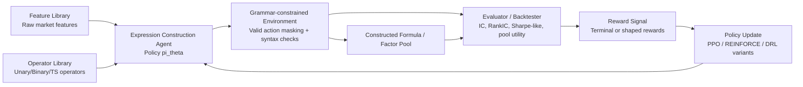

Caption: A unified view of alpha mining as grammar-constrained sequential decision making with offline evaluation.

## 4. Methodological Paradigms in RL-based Alpha Mining

**Figure 2. Methodological Landscape of RL-based Alpha Mining**

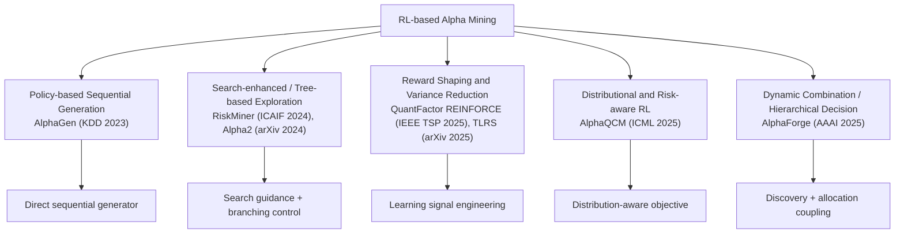

Caption: Methodological paradigms in RL-based alpha mining, grouped by the role RL plays in structured factor discovery.

### 4.1 Policy-based Sequential Expression Generation

One-line takeaway: **AlphaGen’s key contribution is optimizing pool-level downstream factor quality rather than only standalone factor merit.**

A first line of work treats alpha generation as token-by-token or step-by-step expression construction. AlphaGen (KDD 2023) is the representative example of this paradigm. Its key practical move is to optimize the downstream combined-factor performance directly, rather than only optimizing each factor in isolation. Concretely, the policy generates candidate formulas under grammar masks, inserts accepted factors into a pool, and uses pool-level combination performance as the dominant return signal.

**Paper Visual: AlphaGen (KDD 2023) Training Pipeline**

Caption: AlphaGen optimizes formula generation through pool-level downstream performance rather than isolated single-factor scores.

From an optimization viewpoint, the policy seeks

\[
\max_\theta \; \mathbb{E}_{f \sim \pi_\theta}\bigl[\mathrm{Eval}(f)\bigr],
\]

or, when a factor collection is produced,

\[
\max_\theta \; \mathbb{E}_{\mathcal{P}\sim \pi_\theta}\bigl[\mathrm{Eval}(\mathcal{P})\bigr].
\]

Under a PPO-style surrogate, one may instead optimize

\[
L^{\mathrm{PPO}}(\theta)=\mathbb{E}\!\left[\min\!\left(r_t(\theta)\hat{A}_t,\ \mathrm{clip}\!\left(r_t(\theta),1-\epsilon,1+\epsilon\right)\hat{A}_t\right)\right],
\]

with

\[
r_t(\theta)=\frac{\pi_\theta(a_t\mid s_t)}{\pi_{\theta_{\mathrm{old}}}(a_t\mid s_t)}.
\]

Here \(\theta_{\mathrm{old}}\) denotes the previous policy parameters used to collect trajectories, and \(\epsilon\) is the PPO clipping radius. The formula is standard, but in alpha mining its success still depends critically on whether \(\hat{A}_t\) carries meaningful information about partially built expressions.

The attraction of this formulation is its conceptual uniformity. Once factor construction is cast as a trajectory, the framework can directly optimize downstream criteria rather than relying only on supervised imitation or handcrafted search heuristics. Grammar masks can be incorporated naturally, and the approach scales to multi-step generation in a way that preserves a clear agent-environment interface.

Its limitations are equally clear. The reward signal is typically sparse, appearing only at the end of a trajectory. Credit assignment is therefore difficult, especially when expression length increases. Sequence-based representations may also fail to capture tree structure faithfully, which can matter when the semantics of an expression depend strongly on hierarchical composition. Finally, because evaluation is expensive and noisy, training can become unstable even when the policy architecture itself is not particularly complex.

Mini synthesis: This line established RL-based pool-aware generation, but left reward sparsity and structural exploration efficiency largely unresolved.

### 4.2 Search-enhanced Methods and Tree-based Exploration

One-line takeaway: **RiskMiner’s central move is to reformulate alpha mining as a reward-dense, risk-seeking tree-search problem, while Alpha2 moves validity checks into generation-time pruning.**

A second paradigm emphasizes the search-theoretic nature of alpha mining. RiskMiner (ICAIF 2024) and Alpha2 (arXiv 2024 preprint) illustrate this direction. These methods treat candidate expressions as tree-structured symbolic objects and use search-enhanced procedures, including neural-guided exploration or Monte Carlo tree search (MCTS), to navigate the space of feasible formulas.

In such methods, the key recursion is often closer to tree backup than to flat trajectory optimization. A generic action-value estimate may be written as

\[
Q(s,a)=\mathbb{E}\bigl[\mathrm{Eval}(f)\mid s_0=s,a_0=a\bigr],
\]

while selection in tree search may follow an upper-confidence-style rule of the form

\[
a_t = \arg\max_{a \in \mathcal{A}_{\mathrm{valid}}(s_t)} \left( Q(s_t,a) + c\,U(s_t,a) \right),
\]

where \(U(s_t,a)\) is an exploration bonus. The specific formula varies across methods, but the structural point is that partial expressions are evaluated through search statistics over a branching symbolic space.

A canonical example is a PUCT-style term

\[
U(s,a)=P_\theta(a\mid s)\frac{\sqrt{N(s)}}{1+N(s,a)},
\]

where \(N(s)\) is the number of visits to node \(s\), \(N(s,a)\) is the number of times edge \((s,a)\) has been selected, and \(P_\theta(a\mid s)\) is a learned action prior. This makes the RL-search hybrid explicit: learning provides a proposal prior, while search performs structured credit allocation over symbolic expansions.

RiskMiner further introduces a reward-dense design with both intermediate and terminal rewards, then optimizes a risk-seeking (upper-quantile-oriented) objective instead of plain mean return. Its empirical claim is that this combination improves search stability and best-case alpha discovery compared with PPO-style baselines. Alpha2, in contrast, makes a strong representation-level contribution: it reformulates alpha construction as program generation with instruction tuples and explicit register semantics, enabling pre-calculation dimensional checking to prune invalid expansions early. This is important because it turns "validity checking after generation" into "validity-aware generation."

**Paper Visual: RiskMiner (ICAIF 2024) MCTS + Risk-seeking Loop**

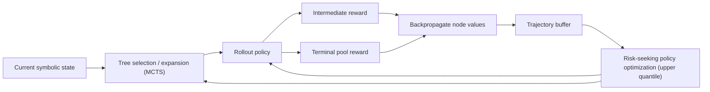

Caption: RiskMiner combines reward-dense MDP design with risk-seeking MCTS-guided policy learning.

**Paper Visual: Alpha2 (arXiv 2024) Program-construction Workflow**

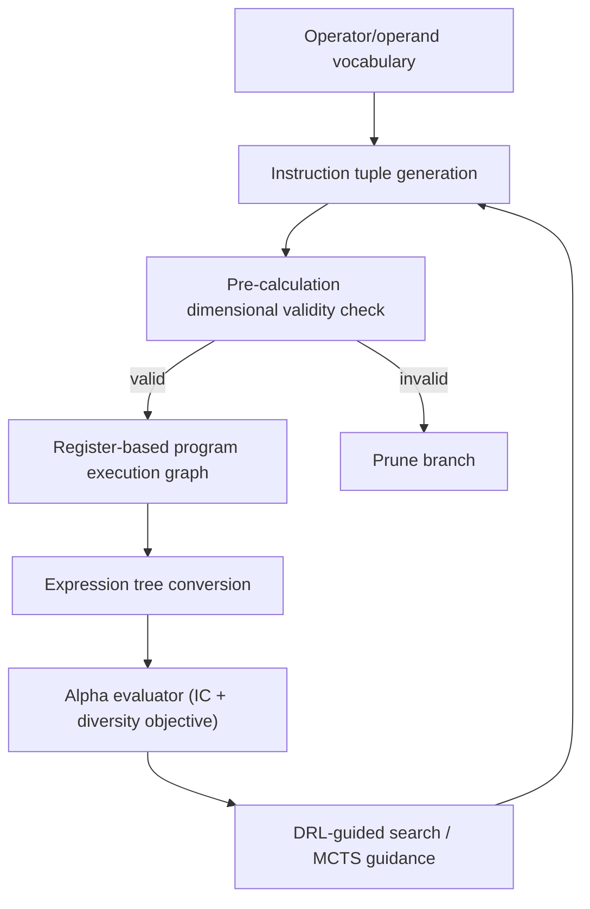

Caption: Alpha2 emphasizes validity-aware generation by integrating dimensional checks into program construction.

The main insight is that alpha mining often looks less like continuous control and more like structured tree expansion under strict syntactic constraints. Search-based methods can exploit partial structure more directly than flat sequence policies. They may also allow more deliberate exploration by allocating search effort to promising branches, rather than relying only on stochastic sampling from a learned policy.

These methods suggest that alpha mining may be closer to symbolic search than to standard continuous-control reinforcement learning. This is not only a modeling observation but also an algorithmic one. If the core object is a constrained expression tree and if evaluation is expensive, then search control, branching heuristics, and structure-aware priors may matter as much as, or more than, generic policy optimization machinery.

The weakness of this family is that search cost can grow quickly with branching factor and depth. Performance may also depend heavily on the quality of value estimates or rollout heuristics used to guide the tree search. Moreover, the conceptual line between RL and neural-guided symbolic search becomes blurred, which makes claims about generalization or sample efficiency harder to interpret.

Mini synthesis: Search-enhanced methods improve structural exploration, but they trade optimization stability for increased search complexity and interpretation ambiguity between RL and search.

### 4.3 Reward Shaping and Variance Reduction

One-line takeaway: **QuantFactor REINFORCE argues that near-deterministic symbolic environments can favor stable Monte Carlo policy gradients over critic-heavy bootstrapping.**

A third paradigm centers on the quality of the learning signal rather than on the policy class. QuantFactor REINFORCE (IEEE TSP 2025) and Learning from Expert Factors: Trajectory-level Reward Shaping for Formulaic Alpha Mining (arXiv 2025 preprint) both exemplify this line of work. Their shared premise is that in alpha mining, sparse and noisy evaluator outputs can dominate the optimization difficulty.

Formally, reward shaping introduces auxiliary signals \(\tilde{R}_t\) so that the return becomes

\[
\tilde{G}_t=\sum_{k=t}^{T}\gamma^{k-t}\tilde{R}_k,
\]

with \(\tilde{R}_T\) retaining the final evaluator component and \(\tilde{R}_t\) for \(t<T\) providing intermediate guidance. A potential-based version would write

\[
\tilde{R}_t = R_t + \gamma \Phi(s_{t+1}) - \Phi(s_t),
\]

where \(\Phi\) is a shaping potential that assigns heuristic value to intermediate states. Even when practical methods do not use this exact form, the equation clarifies the objective: inject information into intermediate steps without completely altering the target task.

Variance reduction can also be written directly at the gradient level:

\[
\mathrm{Var}\!\left[\sum_{t=0}^{T}\nabla_\theta \log \pi_\theta(a_t\mid s_t)\,(R_T-b_t)\right],
\]

which is large when \(R_T\) is noisy and shared across many actions. A well-designed baseline \(b_t \approx \mathbb{E}[R_T\mid s_t]\) reduces this variance without changing the unbiasedness of the estimator. This is especially important in alpha mining, where evaluator noise is often substantial relative to the incremental contribution of any single construction step.

QuantFactor REINFORCE gives a concrete argument for preferring REINFORCE over PPO in this setting: because the symbolic environment transition is near-deterministic (Dirac-like) and reward is trajectory-level, critic-based bootstrapping can inject bias without strong variance reduction benefits. It therefore uses a Monte Carlo policy gradient with a dedicated greedy baseline and introduces information ratio (IR) shaping to favor steadier factors under volatility changes.

The expert-shaping line (TLRS) adds another concrete mechanism. Instead of only potential differences on coarse states, TLRS assigns intermediate rewards by subsequence-level matching between partially generated symbolic expressions and expert formulas. A simple abstract form is

\[
\tilde{R}_t = R_t + \eta \,\mathrm{Sim}\!\left(\mathrm{subseq}(e_t),\mathcal{E}\right) - \bar{m}_t,
\]

where \(\mathcal{E}\) is an expert formula set, \(\mathrm{Sim}\) is a structural similarity score, and \(\bar{m}_t\) is a running-centering term used to stabilize training variance. This is practically meaningful because it injects domain priors without forcing hard imitation.

**Paper Visual: QuantFactor REINFORCE (IEEE TSP 2025)**

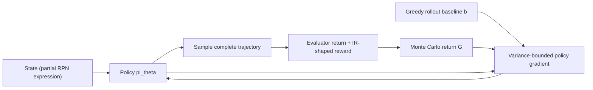

Caption: QuantFactor REINFORCE removes critic dependence and uses a dedicated baseline plus IR shaping for stable updates.

**Paper Visual: TLRS (arXiv 2025) Expert-guided Reward Shaping**

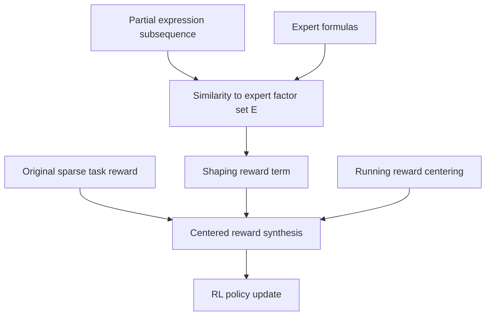

Caption: TLRS provides dense structural supervision by subsequence-level matching to expert formulas.

In this view, the main challenge is not merely to improve exploration, but to produce informative and stable rewards from expensive offline evaluation. Reward shaping, control variates, variance reduction, and expert-informed trajectory signals can all make policy learning more tractable. Dense or semi-dense training feedback may, in some cases, offer larger gains than replacing a simple policy with a more sophisticated one.

This perspective is important because it shifts attention from agent complexity to evaluator design. In alpha mining, the main difficulty may lie less in policy optimization itself than in obtaining informative and stable learning signals from expensive offline evaluators. The benefit is obvious: better reward design can improve training stability, reduce variance, and make search more sample-efficient.

The risk, however, is that shaping may introduce additional inductive bias or hidden objective mismatch. If intermediate rewards are poorly aligned with end goals, the agent may learn shortcuts that look favorable under the shaped signal but do not translate into robust factor quality. Reward engineering therefore helps, but it also makes the validity of the evaluator even more central.

Mini synthesis: This line clarifies that reward channel quality is often the practical bottleneck, but also increases sensitivity to shaping bias.

### 4.4 Distributional and Risk-aware Reinforcement Learning

One-line takeaway: **AlphaQCM’s distinctive contribution is using distributional uncertainty, not mean value alone, to guide exploration in non-stationary sparse-reward settings.**

AlphaQCM (ICML 2025) represents a distinct move toward distributional and risk-aware modeling. The key argument is that expected reward alone may be too weak a target for financial factor discovery. Candidate factors can have similar average performance yet very different uncertainty profiles, downside behavior, tail risk, or regime sensitivity.

Instead of estimating only \(Q^\pi(s,a)=\mathbb{E}[G_t\mid s_t=s,a_t=a]\), distributional RL models the full return law

\[
Z^\pi(s,a) \overset{D}{=} G_t \mid (s_t=s,a_t=a),
\]

or a parameterization of its quantiles. This is especially relevant when two factors satisfy

\[
\mathbb{E}[Y_{f_1}] \approx \mathbb{E}[Y_{f_2}],
\]

but differ substantially in lower-tail behavior such as

\[
\mathrm{CVaR}_{\alpha}(Y_{f_1}) \neq \mathrm{CVaR}_{\alpha}(Y_{f_2}).
\]

If \(F_{Y_f}\) denotes the return distribution of factor \(f\), then a quantile-based objective may be expressed through

\[
q_\tau(Y_f)=\inf\{y: F_{Y_f}(y)\ge \tau\},
\]

and a downside-sensitive optimization target could emphasize lower quantiles:

\[
J_{\mathrm{dist}}(\theta)=\mathbb{E}_{f \sim \pi_\theta}\!\left[\sum_{m=1}^{M}\omega_m q_{\tau_m}(Y_f)\right],
\]

where \(\tau_m \in (0,1)\) are quantile levels and \(\omega_m\) are their corresponding weights. Larger weight on lower quantiles corresponds to stronger emphasis on downside robustness.

AlphaQCM is technically more specific than a generic distributional-RL claim. It couples a Q-network (for mean value) with a quantile network (IQN-style quantile learning), then derives an exploration variance estimate through quantiled conditional moments (QCM). The action score can be summarized as

\[
\mathrm{Score}(s,a)=\widehat{Q}(s,a)+\lambda\sqrt{\widehat{\mathrm{Var}}_{\mathrm{QCM}}(s,a)},
\]

where \(\widehat{\mathrm{Var}}_{\mathrm{QCM}}(s,a)\) is extracted from learned quantiles and used as an uncertainty bonus. The central claim is that this variance estimator is more robust in the non-stationary alpha-mining setting than naive quantile-variance plug-ins.

**Paper Visual: AlphaQCM (ICML 2025)**

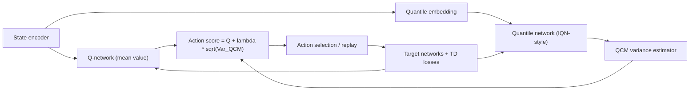

Caption: AlphaQCM jointly learns mean and distributional value signals, using QCM variance for uncertainty-aware exploration.

Distributional RL addresses this by estimating return distributions rather than only their means. In the context of alpha mining, this is attractive for two reasons. First, financial signals are inherently noisy and heavy-tailed. Second, factor selection in practice is rarely risk-neutral: researchers care about stability, drawdown behavior, and uncertainty, not just expected payoff.

Compared with conventional value learning, distributional modeling offers a more natural way to incorporate downside risk, tail sensitivity, and ambiguity about future performance. This aligns well with the financial setting, where mean performance alone is often insufficient to justify deployment. A factor with slightly lower average reward but more stable distributional behavior may be preferable to one with higher but fragile mean performance.

The limitation of this paradigm is that richer return modeling does not solve the underlying evaluator problem. If the backtest itself is biased, unstable, or unrealistic, modeling its output distribution more precisely may still optimize the wrong object. Nonetheless, risk-aware and distributional methods provide an important conceptual bridge between RL methodology and the actual decision logic used in quantitative finance.

Mini synthesis: Distributional methods improve uncertainty-aware search, but still depend fundamentally on evaluator fidelity.

**Figure 3. Expected Return versus Return Distribution**

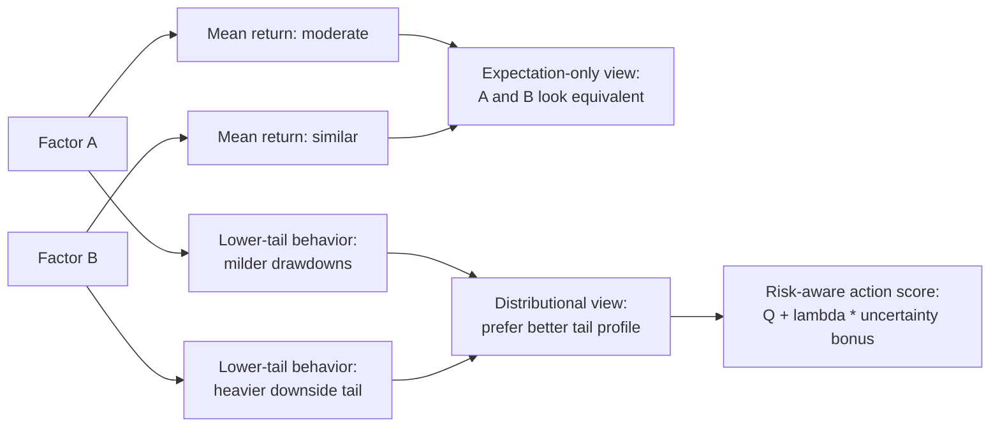

Caption: Two candidate factors may have similar mean performance but very different return distributions, motivating distributional objectives.

### 4.5 Dynamic Factor Combination and Hierarchical Decision Making

One-line takeaway: **AlphaForge’s core insight is that factor discovery and factor deployment should be modeled jointly rather than sequentially.**

AlphaForge (AAAI 2025) expands the scope of the problem from factor discovery alone to factor discovery plus dynamic combination. This is a meaningful shift. In many realistic settings, the objective is not to find a single best alpha, but to maintain a pool of useful factors and adapt their usage over time as market conditions change.

One can formalize this by separating discovery and allocation. Let \(\mathcal{P}_t=\{f^{(1)},\dots,f^{(K)}\}\) be the candidate pool at time \(t\), and let \(w_t \in \Delta^{K-1}\) be a simplex-constrained weight vector. The deployed composite signal is then

\[
F_t = \sum_{k=1}^{K} w_t^{(k)} f_t^{(k)}.
\]

The decision problem becomes hierarchical: one policy proposes or updates \(\mathcal{P}_t\), while another adapts \(w_t\) conditional on market context.

If the allocation policy is parameterized by \(\psi\), one may write

\[
w_t = \mu_\psi(c_t,\mathcal{P}_t,h_t),
\]

and optimize a coupled objective

\[
\max_{\theta,\psi}\; \mathbb{E}\!\left[\sum_{t=1}^{N} \mathcal{U}\!\left(F_t\right)\right],
\]

where \(\mu_\psi\) is the allocation policy, \(\theta\) governs discovery, \(\psi\) governs allocation, and \(\mathcal{U}(F_t)\) is the utility assigned to the combined signal \(F_t\) at time \(t\). This formulation is important because it shows that the value of a discovered factor is endogenous to the downstream combination policy.

In implementation terms, AlphaForge uses a generative-predictive mining module (a generator guided by a differentiable predictor surrogate for factor fitness) and then a dynamic timing/weighting module to build daily Mega-Alpha. This decomposition is notable because it separates "where to search next" from "how to deploy discovered factors today."

**Paper Visual: AlphaForge (AAAI 2025) Two-stage Architecture**

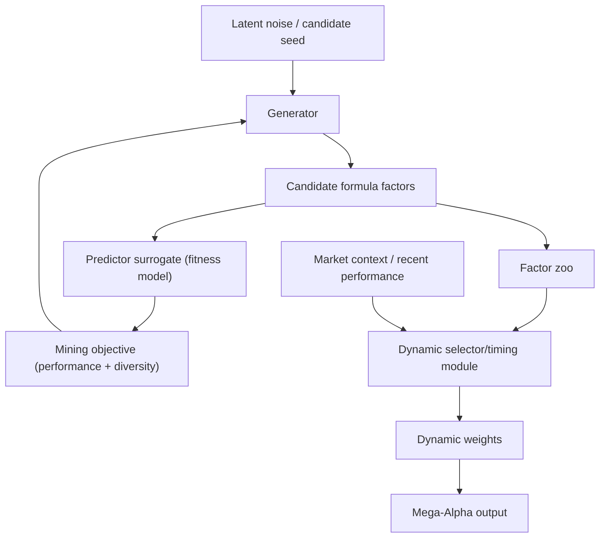

Caption: AlphaForge decouples candidate generation from dynamic deployment through a generator-predictor mining stage and a timing-aware combination stage.

This leads naturally to a two-level decision view. At one level, the system discovers or updates candidate factors. At another, it allocates attention, weights, or exposure across the candidate pool in response to regime information or performance feedback. Alpha mining may therefore be inherently a two-level decision problem: discovering useful candidate factors and adapting their usage over time.

The advantage of this perspective is that it better matches actual quantitative workflows, where discovery and combination are tightly coupled. It also opens the door to hierarchical policies, regime-aware allocation, and modular systems in which different components specialize in proposal, evaluation, and deployment.

Its main challenge is compounded complexity. Once discovery and allocation are optimized jointly, the credit assignment problem becomes even harder, and the distinction between signal generation and portfolio construction may become blurred. Nevertheless, this paradigm is valuable because it pushes the field closer to realistic usage rather than treating factor mining as an isolated symbolic generation task.

Mini synthesis: Joint discovery-deployment frameworks increase realism, but introduce harder coupled credit assignment.

**Figure 4. Discovery plus Allocation Two-level Framework**

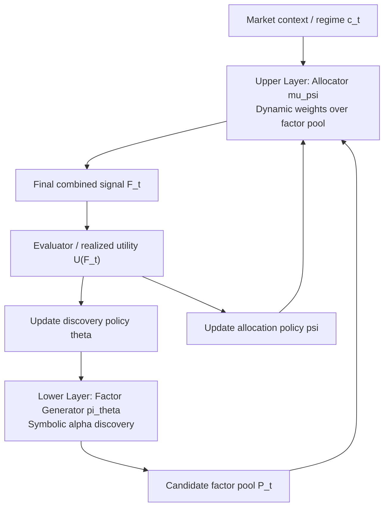

Caption: A two-level view of alpha mining in which factor discovery and dynamic allocation are optimized jointly.

### 4.6 Recent Extensions Beyond the 2023–2025 Core Line

Recent 2026 work can be viewed as extensions rather than replacements of the 2023–2025 core line. **AlphaSAGE (ICLR 2026)** emphasizes structure-aware diverse generation by combining AST-based encoding with GFlowNet-style sampling and multi-signal rewards (predictive power, structure-behavior alignment, novelty). Its main value is reducing mode collapse while keeping symbolic interpretability. **AlphaAgentEvo (ICLR 2026)** reframes alpha mining as multi-turn policy evolution: the agent repeatedly refines seed formulas through tool feedback under hierarchical rewards. Its main value is improving evolution efficiency and robustness in longer interaction horizons.

Mini synthesis: These extensions reinforce two emerging priorities for the field: diversity-first generation and trajectory-level self-improvement, both built on top of the earlier RL/search foundations.

## 5. Representative Papers and Comparative Analysis

### 5.1 Chronological Overview

The recent literature shows a clear evolution in research emphasis. AlphaGen in 2023 demonstrated a policy-based framework for generating synergistic formulaic alpha collections through sequential decision making. By 2024, RiskMiner and Alpha2 were already pushing the field toward tree-based and logic-oriented search, highlighting the structural nature of the search space. In 2025, the focus broadened further: AlphaForge moved toward dynamic factor combination, QuantFactor REINFORCE emphasized reward stability and variance control, and AlphaQCM introduced distributional RL for uncertainty-aware discovery. The 2026 wave adds two new emphases: AlphaSAGE (ICLR 2026) makes structure-aware diverse generation explicit via AST+GFlowNet; AlphaAgentEvo (ICLR 2026) makes iterative self-evolution explicit via multi-turn agentic RL.

This trajectory is notable because it does not simply reflect larger models or more complex policies. Instead, the field appears to be recognizing that the core difficulty is structural. The research focus has gradually shifted from asking whether RL can generate useful factors at all to asking how such methods can become more stable, more robust, and more faithful to the true objectives of alpha mining.

### 5.2 Comparison Table

| Paper | Venue | Core formulation | Representation | RL/Search mechanism | Reward type | Pool-aware? | Dynamic allocation? | Key contribution | Main limitation |
|------|------|------|------|------|------|------|------|------|------|
| AlphaGen | KDD 2023 | Sequential generation for synergistic pool construction | RPN-like sequence | PPO-style policy optimization with masks | Mainly terminal, pool-level performance oriented | Yes | No | Optimizes downstream pool quality instead of isolated factor merit | Sparse delayed reward, weak tree bias |
| RiskMiner | ICAIF 2024 | Reward-dense MDP over symbolic tree expansion | Expression tree | Risk-seeking MCTS + policy updates | Intermediate + terminal rewards; upper-quantile emphasis | Yes | No | Recasts mining as reward-dense, risk-seeking tree search | High search cost and tuning sensitivity |
| Alpha2 | arXiv 2024 | Program-construction alpha generation | Instruction tuples + AST | DRL-guided search / MCTS-style guidance | Performance + diversity objective | Yes | No | Moves validity checking into generation-time structural pruning | Preprint; added system complexity |
| QuantFactor REINFORCE | IEEE TSP 2025 | Monte Carlo policy optimization in near-deterministic symbolic MDP | Sequence/grammar-constrained construction | REINFORCE with dedicated baseline | IR-shaped terminal reward with variance control | Often pool-aware in evaluation | No | Argues stable Monte Carlo gradients can outperform critic-heavy updates in this setting | Sensitive to baseline and shaping design |
| AlphaQCM | ICML 2025 | Non-stationary reward-sparse MDP with uncertainty-aware exploration | Sequence + distributional value representation | DQN + IQN + QCM variance bonus | Distributional reward modeling and uncertainty bonus | Yes | No | Uses distributional uncertainty to guide exploration beyond mean value | More components; evaluator dependence remains |
| AlphaForge | AAAI 2025 | Two-level discovery-plus-deployment framework | Candidate factor pool + allocation layer | Generative-predictive mining + dynamic combiner | Fitness + diversity + deployment utility | Yes | Yes | Models factor discovery and deployment jointly | Coupled credit assignment is harder |

### 5.3 Comparative Discussion

A concise way to compare representative work is by the role RL plays in each framework. AlphaGen mainly uses RL as a direct symbolic generator; RiskMiner and Alpha2 push RL toward structured search control; QuantFactor REINFORCE and TLRS treat learning-signal quality as the primary bottleneck; AlphaQCM introduces uncertainty-aware exploration; AlphaForge explicitly couples discovery and deployment.

Across these methods, the main research shift is from “can RL generate factors” to “how should generation be constrained, evaluated, and deployed.” This is why reward design, evaluator reliability, and representation choice now matter as much as policy architecture.

Recent quantitative gains are encouraging but should be read with protocol caution: AlphaQCM reports stronger IC on large universes (e.g., 8.49%, 9.55%, 9.16% in its setting), QuantFactor REINFORCE reports about 3.83% correlation improvement, and TLRS reports about 9.29% RankIC improvement over potential-based shaping baselines.

Mini synthesis: Section 5 shows that representative papers are best distinguished by *which bottleneck they attack* (search structure, reward quality, uncertainty modeling, or deployment coupling), not by publication year alone.

## 6. Core Challenges and Limitations

The first major challenge is sparse and delayed reward. Intermediate construction steps often have little standalone financial meaning, and useful feedback usually appears only after a complete expression has been evaluated. This makes credit assignment difficult and weakens the learning signal for long-horizon generation.

In the extreme case \(R_t=0\) for \(t<T\), so every policy update must infer the value of all preceding actions from a single noisy terminal scalar \(R_T\). The signal-to-noise ratio deteriorates rapidly as trajectory length grows.

If two trajectories \(\tau\) and \(\tau'\) differ only at an early step but satisfy \(R_T(\tau)\approx R_T(\tau')\) within evaluator noise, then

\[
\nabla_\theta \log \pi_\theta(\tau)\,R_T(\tau) \approx \nabla_\theta \log \pi_\theta(\tau')\,R_T(\tau'),
\]

making it difficult to distinguish whether the early decision actually mattered. This is precisely the credit-assignment pathology that motivates shaping and critic learning.

Moreover, the symbolic nature of the task adds a "validity bottleneck": many partial trajectories are formally invalid or dimensionally inconsistent. Alpha2's program-construction formulation is important here because it shows that part of the sparse-reward problem can be converted into a constrained-search problem with earlier structural pruning.

The second, and perhaps most important, challenge is overfitting to the evaluator. In many RL-based alpha mining systems, the environment is effectively a historical evaluator or backtester. An agent may therefore learn to exploit quirks of the scoring pipeline rather than discover genuinely robust financial structure. Overfitting can occur at the expression level, the factor-pool level, or the full backtest level. This issue is more fundamental than ordinary hyperparameter overfitting because it concerns the validity of the environment definition itself.

If the true deployment objective is \(\mathcal{L}_{\mathrm{real}}(f)\) but training optimizes only \(\mathcal{L}_{\mathrm{hist}}(f)\), then the learned policy may satisfy

\[
\arg\max_f \mathcal{L}_{\mathrm{hist}}(f) \neq \arg\max_f \mathcal{L}_{\mathrm{real}}(f),
\]

which is a direct statement of evaluator mismatch rather than a mere estimation error.

Equivalently, if \(D_{\mathrm{train}}\) and \(D_{\mathrm{deploy}}\) denote historical and deployment distributions, then

\[
\mathbb{E}_{D_{\mathrm{train}}}[\mathrm{Eval}(f)] \not\approx \mathbb{E}_{D_{\mathrm{deploy}}}[\mathrm{Eval}(f)]
\]

may hold even for the same formula \(f\), where \(D_{\mathrm{train}}\) is the historical evaluation distribution and \(D_{\mathrm{deploy}}\) is the true deployment distribution. The policy may therefore optimize sample-specific artifacts rather than persistent structure.

The third challenge is non-stationarity and regime shift. Financial markets change across time, asset universes, and macro conditions. A factor that appears strong in one period may degrade or reverse in another. An RL agent trained against a fixed historical evaluator can easily become tied to sample-specific regimes, which limits out-of-sample reliability.

A concise formal statement is

\[
P_t(r_{t+1}\mid x_t) \neq P_{t'}(r_{t'+1}\mid x_{t'})
\]

for different market regimes \(t\) and \(t'\). Once this is true, a stationary optimal policy for one period need not remain optimal for another.

The fourth challenge is the limited realism of common evaluation metrics. Information coefficient is useful, but it is not a sufficient definition of a deployable alpha. Real factors must also withstand turnover constraints, transaction costs, risk exposure controls, capacity limits, and stability requirements. A method that optimizes only IC may therefore produce factors that look statistically attractive but are practically weak.

For example, the true utility may be closer to

\[
\mathcal{U}(f)=\mathrm{Return}(f)-\mathrm{Cost}(f)-\xi\,\mathrm{RiskExposure}(f)-\zeta\,\mathrm{Turnover}(f),
\]

while the training pipeline uses only \(\overline{\mathrm{IC}}(f)\). The gap between these objectives is structural, not incidental.

The fifth challenge is grammar-constrained exploration. The action space in alpha mining is not unconstrained: syntax, operator arity, data types, and budget rules all restrict feasible construction paths. Naive exploration wastes effort on invalid or low-value regions of the space. Efficient exploration requires explicit structure awareness rather than simple randomization.

If \(|\mathcal{A}|\) is the full action alphabet but only \(|\mathcal{A}_{\mathrm{valid}}(s)|\) actions are legal at state \(s\), then the feasible-action ratio

\[
\frac{|\mathcal{A}_{\mathrm{valid}}(s)|}{|\mathcal{A}|}
\]

may be very small. This ratio quantifies why unguided exploration is inefficient even before considering financial reward.

This also explains why MCTS-style methods and legality-aware program generation can outperform flat sequence sampling in practice: they use structural constraints as first-class search information rather than as post-hoc filters.

The sixth challenge is objective mismatch arising from the multi-objective nature of the task. Existing methods often collapse predictive power, orthogonality, robustness, and implementability into a single scalar reward. This simplification is convenient for optimization, but it hides real tradeoffs and can bias the search toward factors that score well on one proxy while failing on another practically relevant dimension.

In principle, the problem is closer to

\[
\max_f \; \bigl( J_1(f), J_2(f), \dots, J_m(f) \bigr),
\]

with no canonical total ordering, than to a single-objective problem. Scalarization is useful, but it should be understood as a modeling choice rather than a neutral description of the task.

In particular, different scalarizations

\[
\sum_{j=1}^{m}\lambda_j J_j(f)
\qquad \text{and} \qquad
\sum_{j=1}^{m}\lambda'_j J_j(f)
\]

may induce different optimal solutions. This means that changes in reward weights can alter not only ranking but also the qualitative type of factor the agent discovers.

The seventh challenge is the conceptual ambiguity between RL and search. Some methods are formally cast as RL, but operationally they resemble learned symbolic search or program synthesis. This is not a flaw. The problem is that without recognizing this ambiguity, it becomes difficult to interpret algorithmic gains correctly. Improvements may stem from better search control, stronger grammars, or evaluator bias, rather than from advances in RL in the narrow sense.

At a high level, one can contrast two views:

\[
\text{RL view: } \max_\theta \mathbb{E}_{f \sim p_\theta}[\mathrm{Eval}(f)],
\]

\[
\text{Search view: } \max_{f \in \mathcal{F}_{\le d}} \mathrm{Eval}(f).
\]

The first learns a distribution over formulas; the second seeks an optimizer over the symbolic space directly. Many practical methods lie between these formulations, which is exactly why the boundary is blurry.

**Figure 5. Challenge Map for RL-based Alpha Mining**

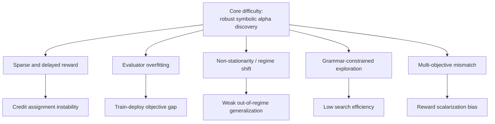

Caption: Core challenges in RL-based alpha mining arise from symbolic structure, noisy offline evaluation, and mismatched objectives.

Taken together, these limitations suggest that the main bottleneck is not weak agents alone. The harder issue is the joint effect of symbolic constraints, evaluator noise, regime dependence, and multi-objective deployment criteria.

Mini synthesis: Section 6 indicates that future gains will depend less on isolated policy upgrades and more on evaluator realism, objective alignment, and structure-aware search design.

## 7. Future Research Directions

One promising direction is tree-structured and grammar-aware policy architecture. Because formulaic alphas are naturally represented as expression trees, structure-aware policies may offer better inductive bias than flattened token generators. This could improve both efficiency and semantic consistency during exploration.

One concrete route is to parameterize policies over trees directly,

\[
\pi_\theta(a_t \mid \mathrm{Tree}(e_t), c_t),
\]

instead of over flattened token histories alone. This would make the policy equivariant to structural relationships that are otherwise obscured by sequence linearization.

A second direction is multi-objective reinforcement learning for alpha mining. Instead of collapsing all desiderata into a single reward, future work could treat predictive power, diversification, robustness, and implementability as explicit objectives. Pareto-based methods, constrained RL, or vector-valued reward formulations are likely to be more faithful to the true task.

For example, one may optimize

\[
\max_\theta \; \bigl(\mathbb{E}[J_1],\dots,\mathbb{E}[J_m]\bigr)
\]

subject to constraints such as

\[
\mathbb{E}[\mathrm{Turnover}(f)] \le \tau_{\max}, \qquad \mathbb{E}[\mathrm{Risk}(f)] \le r_{\max}.
\]

A third direction is robust and regime-aware alpha discovery. This includes regime-conditioned policies, meta-learning across periods or universes, and approaches that explicitly seek invariant factors rather than sample-specific patterns. If non-stationarity is central to the problem, then robustness must be built into the learning objective rather than treated as an afterthought.

A regime-aware policy can be written as

\[
\pi_\theta(a_t\mid s_t, c_t),
\]

where \(c_t\) is a context variable summarizing regime information. More ambitiously, invariant factor discovery would aim to find \(f\) such that

\[
\mathrm{Perf}_{e_1}(f) \approx \mathrm{Perf}_{e_2}(f) \approx \cdots \approx \mathrm{Perf}_{e_M}(f)
\]

across environments \(e_1,\dots,e_M\).

A fourth and especially important direction is offline RL and evaluator-aware learning. Alpha mining is largely performed against offline evaluators, not through live online interaction. This makes the domain structurally closer to offline RL, batch decision making, and conservative evaluation than to standard exploration-heavy benchmarks. Methods that account explicitly for evaluator bias, uncertainty, and limited coverage may therefore be especially relevant.

In this setting, the effective dataset is a static collection

\[
\mathcal{D}=\{(s_t,a_t,r_t,s_{t+1})\}_{t=1}^{n},
\]

possibly induced by previous search trajectories. Conservative learning would then penalize unsupported optimistic estimates, for example through an objective of the schematic form

\[
\min_Q \; \mathcal{L}_{\mathrm{TD}}(Q) + \alpha\,\mathcal{R}_{\mathrm{conservative}}(Q;\mathcal{D}).
\]

The specific regularizer varies, but the principle is clear: avoid assigning unrealistically high value to symbolic actions insufficiently supported by offline evidence.

A complementary direction is expert-guided but non-imitation shaping. The TLRS results suggest that expert formulas can be injected as soft trajectory-level structural hints, instead of hard constraints or supervised targets, preserving exploration while improving sample efficiency.

A fifth direction is search-RL hybrids. RL can provide proposals, priors, or branching heuristics, while beam search, MCTS, or symbolic solvers can handle structured exploration more explicitly. Such hybrids may better match the actual geometry of the search space than either pure policy optimization or pure heuristic search alone.

One generic hybrid factorization is

\[
\text{score}(a\mid s)=\lambda\,\log \pi_\theta(a\mid s) + (1-\lambda)\,H_{\mathrm{search}}(s,a),
\]

where \(H_{\mathrm{search}}(s,a)\) is a search heuristic score for expanding action \(a\) at state \(s\), and \(\lambda \in [0,1]\) balances learned policy confidence against search guidance. This expresses the practical idea that learning and search need not compete; they can provide complementary signals.

A sixth direction is risk-sensitive and distributional objective design. Modeling return distributions, downside risk, and performance uncertainty is likely to be increasingly important if discovered factors are to be trusted beyond narrow historical windows. This line of work is not only methodologically interesting but also financially meaningful.

For instance, one may replace mean maximization by

\[
\max_\theta \; \mathbb{E}[Y_f] - \kappa \,\mathrm{CVaR}_\alpha(-Y_f),
\]

or optimize lower quantiles directly. This is a more natural fit for deployment settings where downside fragility matters more than marginal gains in mean reward.

Finally, better evaluation protocols are necessary. More credible assessment should include cross-period testing, cross-market validation, realistic transaction cost and liquidity assumptions, and explicit evaluation under universe shift or regime shift. Without stronger protocols, it will remain difficult to distinguish genuine discovery from evaluator exploitation.

At the protocol level, one wants not just a single estimate

\[
\hat{\mathcal{L}}(f;D_{\mathrm{train}}),
\]

but a family of estimates

\[
\{\hat{\mathcal{L}}(f;D^{(1)}),\dots,\hat{\mathcal{L}}(f;D^{(M)})\},
\]

where each \(D^{(m)}\) is a different evaluation slice, such as a different market, time period, or cost specification. Stability across these slices is often more informative than peak performance on any one of them.

These directions are actionable rather than merely aspirational. Each points toward a concrete research agenda at the interface of reinforcement learning, symbolic search, and quantitative finance. Progress is likely to come less from scaling generic RL components in isolation than from designing methods that respect the structure and realism of the alpha mining problem.

## 8. Conclusion

Reinforcement learning offers a compelling framework for automating formulaic alpha mining because the task can be cast as sequential construction under delayed evaluation. Recent work has shown that RL can support expression generation, tree-guided exploration, reward shaping, distributional modeling, and dynamic factor combination. This has substantially expanded the methodological vocabulary available for factor discovery.

However, the central difficulty of the field lies not only in policy optimization. Alpha mining is a structured symbolic search problem under expensive offline evaluation, non-stationarity, and multi-objective constraints. Future progress will likely depend on deeper integration between RL, search, financial priors, and more realistic evaluators. In that sense, RL is a promising approach to alpha mining, but not yet a complete solution.
